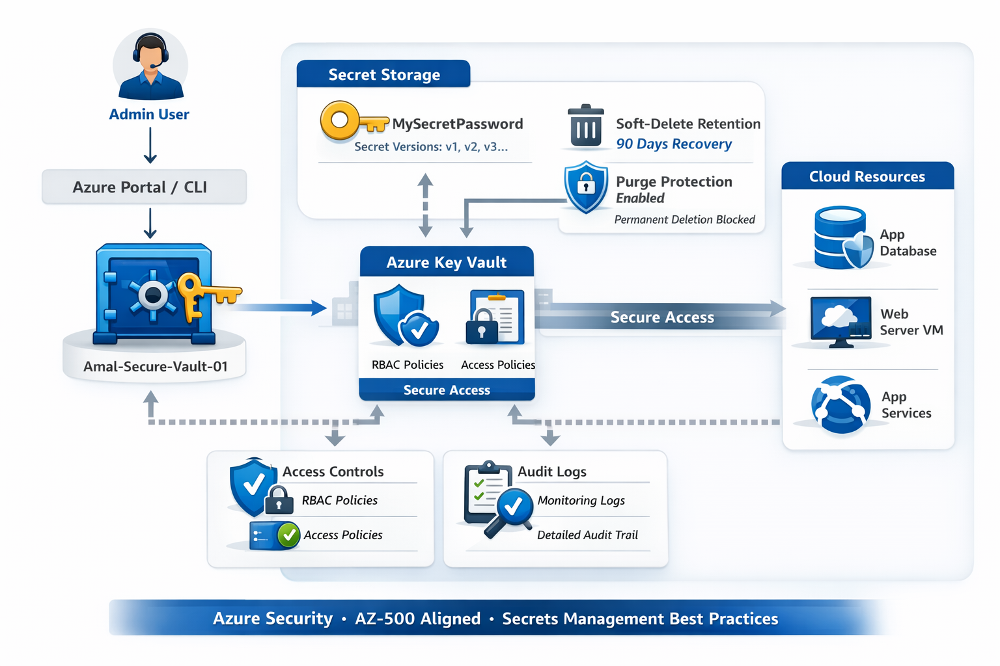
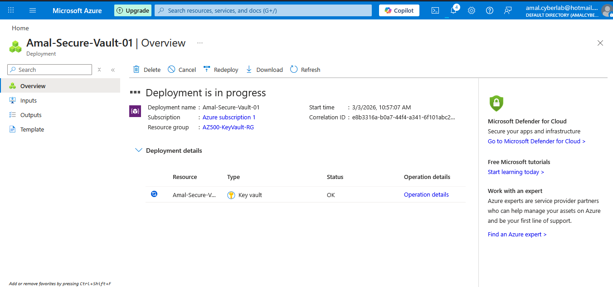
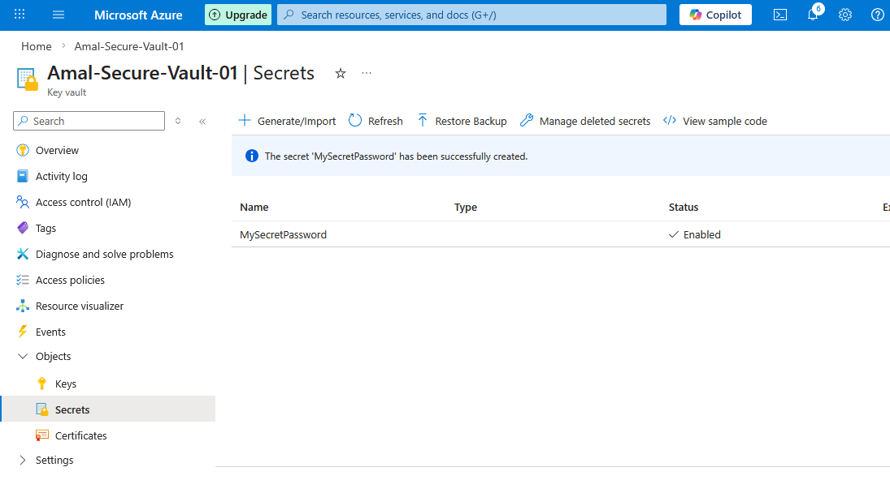
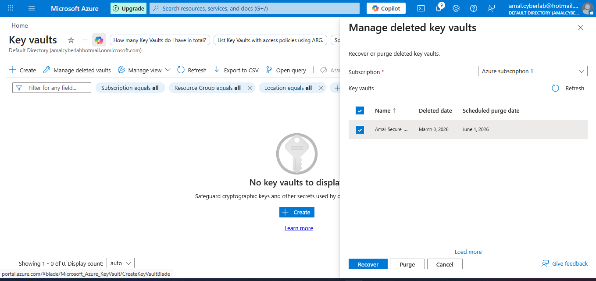
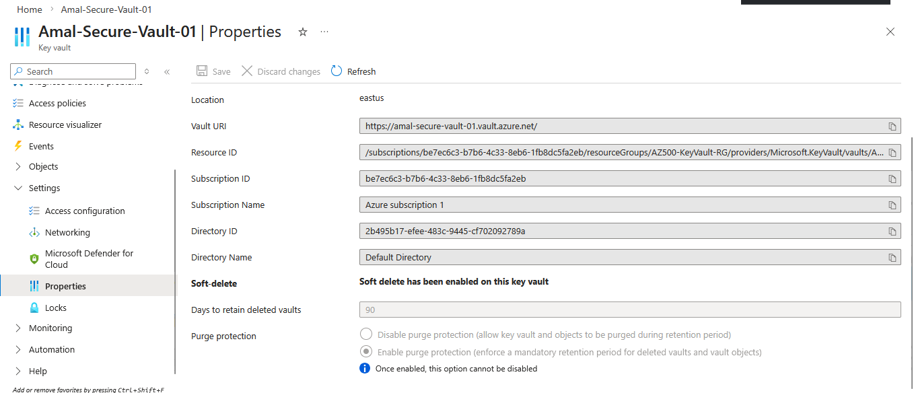
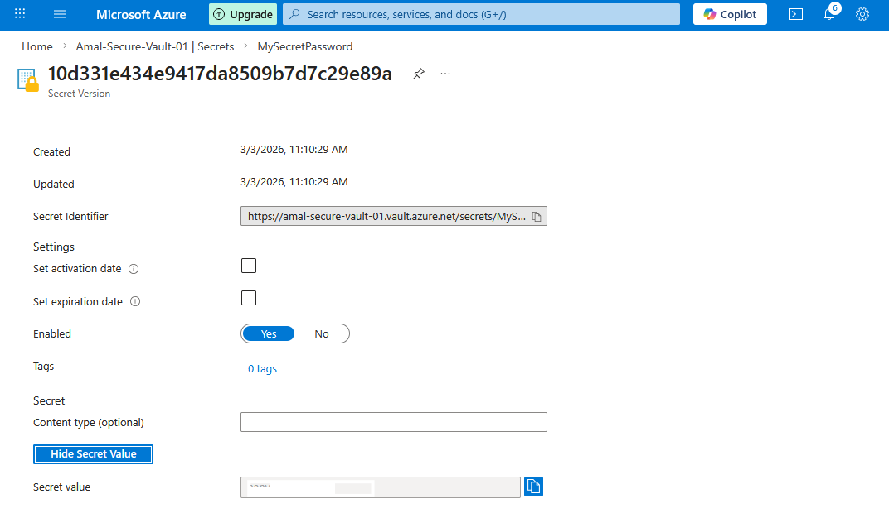

  
  
  
  

<h1 align="center">Azure Key Vault – Secrets Management & Hardening Lab</h1>

  Enterprise-style hands-on Microsoft Azure Key Vault lab demonstrating secure secret lifecycle management, 
  soft-delete protection, purge protection, and security hardening best practices.  
  AZ-500 aligned | Built by Amal Basnayake — Cybersecurity Engineer

  
  
  

---

## 🎯 Lab Objective

This lab demonstrates how to securely manage application secrets using Azure Key Vault.

✔ Create and securely store a secret  
✔ Enable soft-delete with 90-day retention  
✔ Enable purge protection (mandatory recovery enforcement)  
✔ Review secret versions and metadata  
✔ Validate deployment and resource integrity  

---

## 🏗️ Architecture Overview

  

### Architecture Flow:

1. Administrator deploys **Azure Key Vault**
2. Secret (`MySecretPassword`) is stored securely
3. Soft-delete retention policy (90 days) is enforced
4. Purge protection prevents accidental permanent deletion
5. Azure RBAC & access policies control access

This architecture follows secure cloud design principles aligned with AZ-500 exam objectives.

---

## 📸 Screenshots Gallery

<table>
  <tr>
    <td align="center">
      <strong>1️⃣ Secrets List – MySecretPassword Created</strong> 
      
    </td>
    <td align="center">
      <strong>2️⃣ Deployment Overview</strong> 
      
    </td>
  </tr>
  <tr>
    <td align="center">
      <strong>3️⃣ Secret Version & Properties</strong> 
      
    </td>
    <td align="center">
      <strong>4️⃣ Soft-Delete & Purge Protection Enabled</strong> 
      
    </td>
  </tr>
  <tr>
    <td align="center" colspan="2">
      <strong>5️⃣ Key Vault Resource List</strong> 
      
    </td>
  </tr>
</table>

---

## 🚀 Implementation Steps (Technical Summary)

1️⃣ Created new Key Vault  
   - Name: **Amal-Secure-Vault-01**  
   - Resource Group: **AZ500-KeyVault-RG**  
   - Region: **East US**

2️⃣ Generated Secret  
   - Secret Name: **MySecretPassword**
   - Successfully stored and verified

3️⃣ Enabled Security Controls  
   - Soft-delete: **Enabled (90 days retention)**
   - Purge protection: **Enabled**

4️⃣ Verified:
   - Secret versioning
   - Deployment status
   - Vault availability
   - No deleted vault instances

---

## 🧠 Key Security Takeaways

🔐 Soft-delete prevents accidental secret loss  
🛡 Purge protection enforces mandatory retention  
🔄 Secret versioning enables rollback & audit trails  
🎯 Centralized secrets management reduces attack surface  
📘 Critical knowledge area for AZ-500 certification  

---

## 🔗 References

- Azure Key Vault Secrets Overview  
- Soft-delete & Purge Protection Documentation  
- AZ-500 Certification Guide  

---

  <strong>If this lab helped your AZ-500 preparation, consider giving it a ⭐</strong> 
  Fork, clone, or raise issues — contributions welcome!

  Built with dedication by <a href="https://www.linkedin.com/in/amal-udayanga-basnayake">Amal Basnayake</a> 
  Cybersecurity Engineer | Cloud Security | Azure Security Enthusiast

